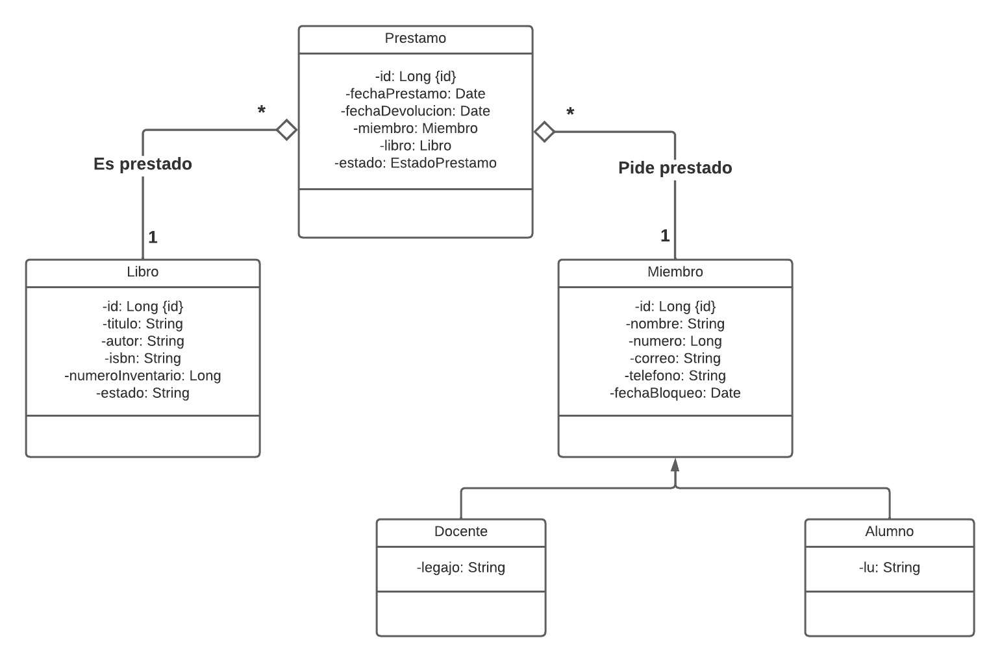

# PROGRAMACION ORIENTADA A OBJETOS
## Profesores
- José Zapana
- Juan Carlos Rodriguez
## Info del proyecto
### Verion de Java
Java 17
### Librerias
* Mysql-Connector-Java
* Spring-Boot-Starter-Test
* Log4j
* Junit
* javax-mail
* spring-Boot-Starter-Mail

### Integrantes
- Enzo Nicolás Meneghini
- Mauricio Miranda

# Sprint 1
## Contexto del Problema

Desarrolla una aplicación de gestión de biblioteca utilizando Java y JPA (Java Persistence API). El
sistema deberá permitir a los bibliotecarios llevar un registro de los libros en la biblioteca, los
préstamos realizados a los miembros y la información básica de los miembros.

## Especificación de requerimientos

- **Gestión de Libros**:

  Crear, editar y eliminar registros de libros.
Cada libro debe tener: id, título, autor, ISBN, ~~cantidad disponible~~, número de inventario y estado.
Validaciones: Considere que NO puede existir en la biblioteca, un libro que tenga el mismo ISBN y mismo
número de inventario, implemente la validación correspondiente.

- **Gestión de Miembros**:

  Crear, editar y eliminar registros de miembros de la biblioteca.
Cada miembro debe tener id, nombre, número de miembro, correo electrónico y número de teléfono.
Los miembros están clasificados en alumnos y docentes, Los docentes tienen número de legajo mientras que
los alumnos tienen libreta universitaria, el resto de los atributos es igual para ambos.

  Validaciones: Considere que el email debe ser único para cada miembro, implemente la validación
correspondiente

- **Gestión de préstamos:**
Para cada préstamo se debe registrar: id, miembro, libro, fecha y hora del préstamo, fecha y hora de la
devolución, estado del préstamo (prestado o devuelto).

- **Búsqueda y Consultas**:

  Permitir la búsqueda de libros por título, autor o ISBN.

- **Validación de las funcionalidades**

  Todas las funcionalidades solicitadas deben realizarse utilizando pruebas unitarias

## Consideraciones
- Implemente correctamente el proyecto utilizando Gitlab y agregue al profesor de práctica como miembro del
equipo. Deben crear un nuevo proyecto gitlab con la nueva distribución de grupos de alumnos

- Implemente los patrones de diseño Service Layer, DTO, DI
# Sprint 2
## Especificación de requerimientos
El registro de un préstamo debe incluir lo siguiente:
* Agregue el atributo email a los miembros
* Envío de correo electrónico: realizar el envío de un correo electrónico al miembro que
recibió el préstamo, el mismo debe incluir toda la información relevante de la operación
realizada. El correo debe enviarse en formato HTML y debe incluir en la firma el logo de
biblioteca
Consideraciones
- Todas las transacciones deben contar con los logs correctamente diseñados.
- Debe realizar la implementación de este sprint creando ramas features convenientemente
organizadas
- Valide las funcionalidades con pruebas unitarias.
# Sprint 3
Implemente la capa para API Rest que incluya las siguientes funcionalidades:
### Gestión de Préstamos:
- Registrar préstamos de libros a miembros.
- Registrar la fecha de inicio y la fecha de devolución estimada de cada préstamo y
estado.
- Marcar el libro como "en préstamo".
### Devoluciones:
- Registrar la devolución de libros prestados y actualizar la fecha y hora de
devolución.
- Marcar el libro como “Disponible”.
- Sancionar al socio por N días según la cantidad de días de retraso en la devolución, las reglas son las siguientes:
  - Entre 1 a 2 días: corresponden un 3 días de sanción
  - Entre 3 a 5 días: corresponden 5 días de sanción
  - Más de 5 días corresponden 20 días de sanción
- Para registrar la sanción deben realizar los cambios necesarios en las entidades que
correspondan del modelo.
- Modifique también la funcionalidad de préstamos para que la aplicación no permita
registrar un préstamo a un miembro que se encuentre sancionado, en tal caso debe
emitir el mensaje que corresponda.
### Consideraciones
- Puede haber más de una solución a los requerimientos planteados.
- Realicen los cambios que consideren necesarios tanto en las entidades como en los
servicios para diseñar la solución.

## Diagrama UML

